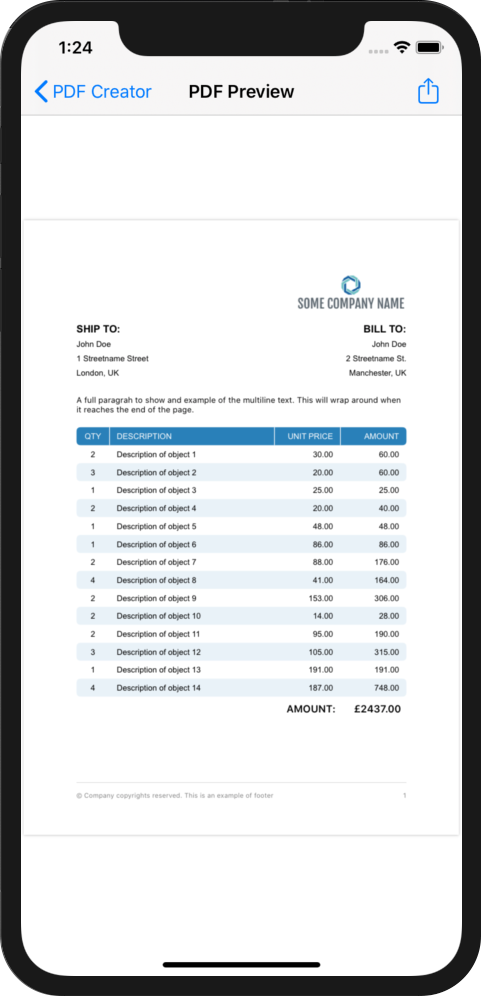
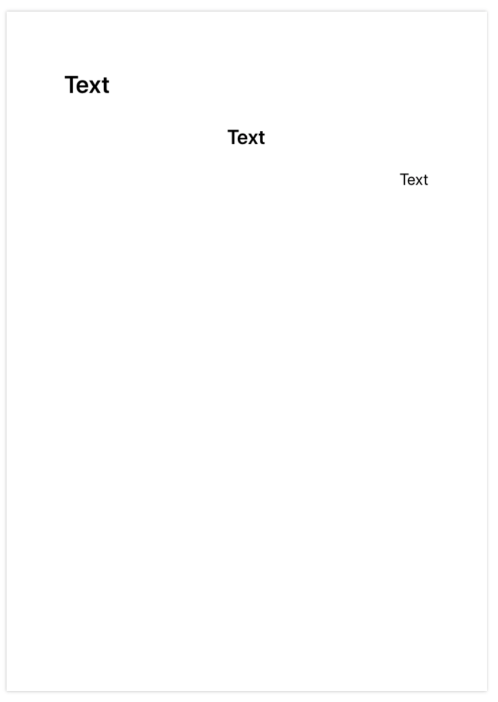
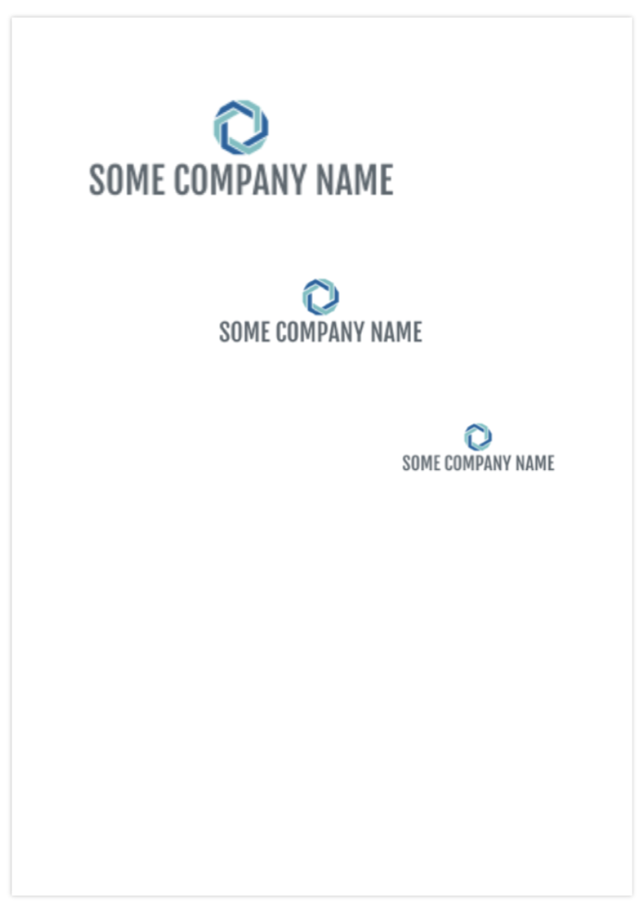
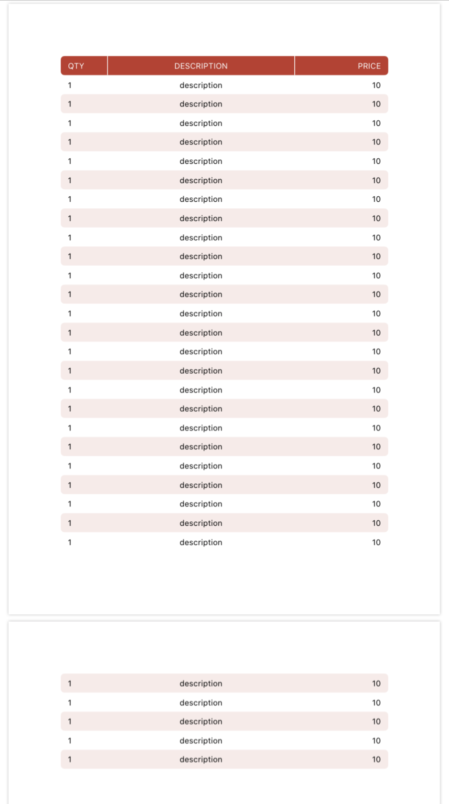
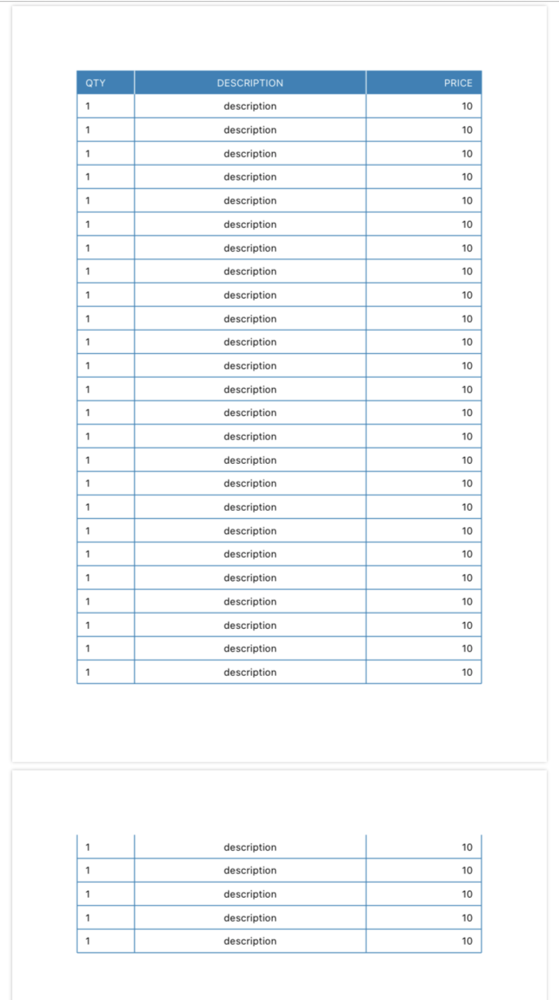
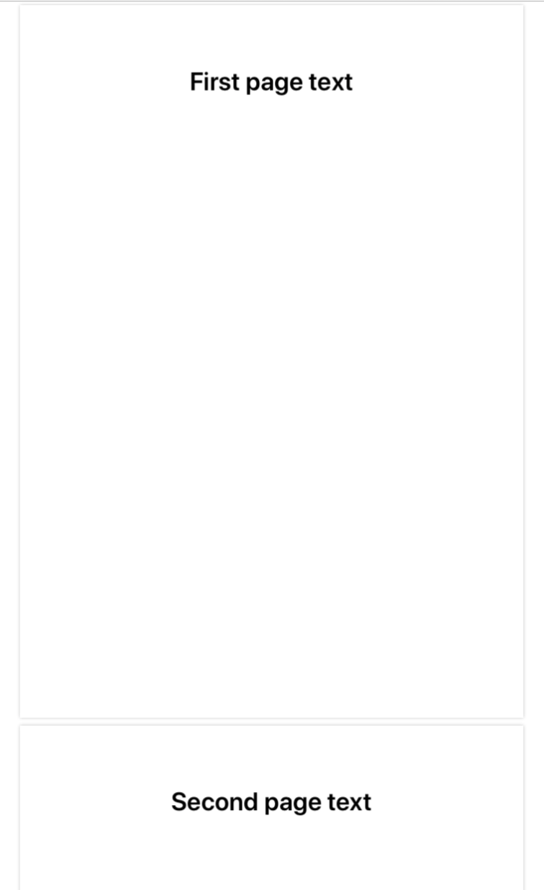

# SimplePDFBuilder
Simple tool to create complex PDF files easily.

## Introduction
`SimplePDFBuilder` is a library built on top of PDFKit and which enables you to easily create PDF files in your app. This is a customisable library that allows you to add text, images and other elements including complex tables, making the creation of PDF files very simple, with no need to draw everything from scratch.


## Table of Contents
- [How to use PDFBuilder](#PDF-Document-parameters)
    - [PDF Document parameters](#PDF-Document-parameters)
    - [Adding Text](#Adding-Text)
    - [Adding Images](#Adding-Images)
    - [Adding Footer](#Adding-Footer)
    - [Adding Tables](#Adding-Tables)
    - [Adding Spaces](#Adding-Spaces)
    - [Start New PDF Page](#Start-New-PDF-Page)
    - [Line holding](#Line-holding)
- [How to use built-in PDF Preview View Controller](#How-to-use-built-in-PDF-Preview-View-Controller)
- [How to create a custom PDF Preview](#How-to-create-a-custom-PDF-Preview)
- [License](#License)


## How to use PDFBuilder
In order to create a simple PDF file with no content on it, you need to import SimplePDFBuilder where you want to use it: 

```swift
import SimplePDFBuilder
```

To build pdf data:

<table>
<tr align="center"> 
    <td>You can use like this:</td> 
    <td>OR like this:</td> 
</tr> 
<tr>
<td>

  ```swift
    let pdf = PDFBuilder()
    //pdf.someChosenMethod ...
    let pdfData = pdf.build()
  ```
</td>
<td>

  ```swift
  let pdfData = PDFBuilder()
                   //.someChosenMethod ...
                   .build()
  ```
</td>
</tr>
</table>

_pdfData_ contains the data of the PDF which is used in PDFView's document property of PDFKit. See section [How to create a custom PDF Preview](#How-to-create-a-custom-PDF-Preview) for more information.


## PDF Document parameters

In order to add metadata to your PDF File use the following:

<sup>_(Example shows a creation of empty PDF file with Meta Data)_</sup>
```swift
let data = PDFBuilder()
            .withMetaAuthor("AuthorName")
            .withMetaCreator("CreatorName")
            .withMetaTitle("Title")
            .build()
```          


There are a few additional parameters that can be set:

<sup>_(Example shows a creation of empty PDF file with default parameters)_</sup>

```swift         
let pdf = PDFBuilder()
pdf.withPaperSize(.A4)              // default value
pdf.withPaperOrientation(.Portrait) // default value
pdf.withTextSpacing(1.08)           // default value (Also Word's default)
pdf.withPaperMargins(.Normal)       // default value
let data = pdf.build()
``` 

- **_withPaperSize_**: Support paper sizes from .A1 to .A7
- **_withPaperOrientation_**: can be .Album or .Portrait
- **_withTextSpacing_**: Spacing of the text in CGFloat
- **_withPaperMargins_**:
    - _.Normal_ - Inch (2.54cm) on each side
    - _.Narrow_ - Half inch (1.27cm) on each side
    - _.Moderate_ - Inch (2.54cm) for top and bottom and 0.75 inch (or 1.91 cm) for left and right
    - _.Wide_ - Inch (2.54cm) for top and bottom and 2 inches (5.08 cm) for left and right


## Adding Text
To add text _addText_ method is used. Added text can be multiline, meaning that if the string is too long for a single line, it will wrap the text around to the next lines.



```swift
pdf.addText(text: "BILL TO:", 
            alignment: .left,             // default value
            font: .boldArial(ofSize: 11), // default value
            colour: .black)               // default value
```
- **_alignment_** - Alignment of the text on the page
- **_font_** - Font of the text
- **_colour_** - Colour of the text


See example on the right:
```swift
pdf.addText(text: "Text", alignment: .left, font: .boldSystemFont(ofSize: 30))
pdf.addText(text: "Text", alignment: .centre, font: .boldSystemFont(ofSize: 25))
pdf.addText(text: "Text", alignment: .right, font: .systemFont(ofSize: 20))
pdf.addText(text: someLongText)
```


## Adding Images
In order to add image to the PDF use:



```swift
pdf.addImage(image: UIImage(named:"Put Your Image Here"), 
             maxWidth: 150, 
             alignment: .right)
```
- **_image_** - UIImage that you want to present on the PDF
- **_maxWidth_** - Width of the image in points (72 points is 1 inch)
- **_alignment_** - Alignment of the text on the page

See example on the right:
```swift
pdf.addImage(image: #imageLiteral(resourceName: "ShowLogo"), maxWidth: 300, alignment: .left)
pdf.addSpace(inches: 1)
pdf.addImage(image: #imageLiteral(resourceName: "ShowLogo"), maxWidth: 200, alignment: .centre)
pdf.addSpace(inches: 1)
pdf.addImage(image: #imageLiteral(resourceName: "ShowLogo"), maxWidth: 150, alignment: .right)
```
To understand what _addSpace_ does refer to [Adding Spaces](#Adding-Spaces) section


## Adding a Footer
To add a footer to the PDF use:

```swift
pdf.addFooter(pagingEnabled: true,
              text: "© Company copyrights reserved example.",
              colour: UIColor.black.withAlphaComponent(0.5))
```
However, if a footer is being added from the current PDF page, the footer will be drawn only from the second page (example):

```swift
pdf.newPage()  // start new PDF page
pdf.addFooter(pagingEnabled: true,
              text: "© Company copyrights reserved example.",
              colour: UIColor.black.withAlphaComponent(0.5))
```


## Adding Tables

To create tables you will first have to create headers and rows. If the rows reach the bottom margin, then a new PDF page will start

Create **headers** as follows:

```swift
let headers = [ PDFColumnHeader(name: "QTY",         alignment: .left,    weight: 1),
                PDFColumnHeader(name: "DESCRIPTION", alignment: .centre,  weight: 4),
                PDFColumnHeader(name: "PRICE",       alignment: .right,   weight: 2)]
```
- **_name_** - Text that will be shown in Table Column's header
- **_alignment_** - Alignment of the **whole** column
- **_weight_** - Weight of the column in comparison with others. In the above example, the 2nd column is 4 times wider than first column and twice as wide as the 3rd


Create **table rows** as follows:
```swift
let tableRows = [ PDFTableRow(["1",  "description",  "10"]),
                  PDFTableRow(["2",  "description",  "15"]) ]
```

Draw **table** from headers and table rows:
```swift
do {
    try pdf.addTable(headers: headers, 
                     rows: tableRows, 
                     tableStyle: .Modern,           // Default value
                     font: .systemFont(ofSize: 11), // Default value
                     tableColour: .darkGray)        // Default value
} catch {
    print(error.localizedDescription)
}
```
- **_tableColour_** - Theme colour of the table
- **_font_** - Font of the text in the table
- **_tableStyle_** - Currently 2 types are supported:


#### PDF Table styles
| Modern | Strict |
| ---- | ---- |
|  |  |


## Adding Spaces
There are to ways of creating space: In inches and in centimeters

```swift
pdf.addSpace(inches: 1.25)
pdf.addSpace(centimeters: 3.4)

pdf.addSpace(inches: -0.5) //Note: it can be negative if needed
```


## Start New PDF Page


To start a new page of the PDF use:
```swift
pdf.newPage()
```

Example of using _newPage_:
```swift
let data = PDFBuilder()
            .addText(text: "First page text", alignment: .centre, font: .boldSystemFont(ofSize: 30))
            .newPage()
            .addText(text: "Second page text", alignment: .centre, font: .boldSystemFont(ofSize: 30))
            .build()
```


## Line holding


Line holding allows you to draw multiple elements with the same top offset in the page.

```swift
pdf.holdLine()
pdf.addText(text: "LEFT TEXT", font: .systemFont(ofSize: 20))
pdf.addText(text: "CENTER TEXT", alignment: .centre, font: .systemFont(ofSize: 20))
pdf.addText(text: "RIGHT TEXT", alignment: .right, font: .systemFont(ofSize: 20))
pdf.releaseLine()

pdf.addSpace(inches: 1)

pdf.holdLine()
pdf.addImage(image: #imageLiteral(resourceName: "ShowLogo"), maxWidth: 200,alignment: .left)
pdf.addImage(image: #imageLiteral(resourceName: "ShowLogo"), maxWidth: 200,alignment: .right)
pdf.releaseLine()
```


## How to use built-in PDF Preview View Controller
The library comes with a built-in controller called `PDFPreviewVC`. It is shown at the very top (first image) of the readme. If you want to use it, here is the code. Make sure your app uses **NavigationController**:

```swift
let pdf = PDFBuilder()

pdf.metaAuthor = "Maks"
pdf.metaCreator = "Maks"
pdf.metaTitle = "My PDF"

pdf.addFooter(pagingEnabled: true,
              text: "© Company copyrights reserved footer.",
              colour: UIColor.black.withAlphaComponent(0.5))

pdf.addText(text: "Sample text")


// Build PDF Data
let data = pdf.build()

let pdfController = PDFPreviewVC(pdfData: data)
navigationController?.pushViewController(pdfController, animated: true)
```


PDFPreviewVC View Controller has a few parameters that can be passed:

```swift
let pdfController = PDFPreviewVC(pdfData: data,
                                 pdfFileName: "Testname",
                                 removeFileOnClose: true)  // Default value
```
- **_pdfData_** - PDF Data that was generate by `PDFBuilder` using _.build()_
- **_pdfFileName_** - If the user will decide to share the file, that will be a name of it.
- **_removeFileOnClose_** - In order to rename and share the file, the app saves it to temporary directory of the app and then shares it. If you don't want to keep the files, set it to true and it will be removed on ViewController's dismissal.


## How to create a custom PDF Preview
If you want to build your custom ViewController as a PDF Preview, firstly you will have to include:

```swift
import PDFKit
```

You will have to create a property in your View Controller:
```swift
private var pdfView = PDFView()
```

Example of Custom PDF View Controller:
```swift 
import UIKit
import PDFKit

class CustomPDFViewController: UIViewController {

    var pdfData: Data?
    private var pdfView = PDFView()
    
    
    override func viewDidLoad() {
        super.viewDidLoad()

        pdfView.backgroundColor = .white
        view.addSubview(pdfView)
        pdfView.translatesAutoresizingMaskIntoConstraints = false
        pdfView.topAnchor.constraint(equalTo: view.topAnchor, constant: 0).isActive = true
        pdfView.bottomAnchor.constraint(equalTo: view.bottomAnchor, constant: 0).isActive = true
        pdfView.leftAnchor.constraint(equalTo: view.leftAnchor, constant: 0).isActive = true
        pdfView.rightAnchor.constraint(equalTo: view.rightAnchor, constant: 0).isActive = true
        
        pdfView.autoScales = true
        pdfView.displayMode = .singlePageContinuous
        pdfView.displaysPageBreaks = true
        
        
        // Create PDFDocument from data
        guard let data = pdfData else { return }
        pdfView.document = PDFDocument(data: data)
        pdfView.autoScales = true
    }

}
```

Then to use it do this in your method where you want to create PDF:
```swift
let pdfData = PDFBuilder()
                .addText(text: "First page text")
                .build()
        
let customPDFViewController = CustomPDFViewController()
customPDFViewController.pdfData = pdfData

self.present(customPDFViewController, animated: true)
```


## License

[](http://badges.mit-license.org)

- **[MIT license](http://opensource.org/licenses/mit-license.php)**
- Copyright 2020 © <a href="https://github.com/MaksBelenko" target="_blank">MaksBelenko</a>.

