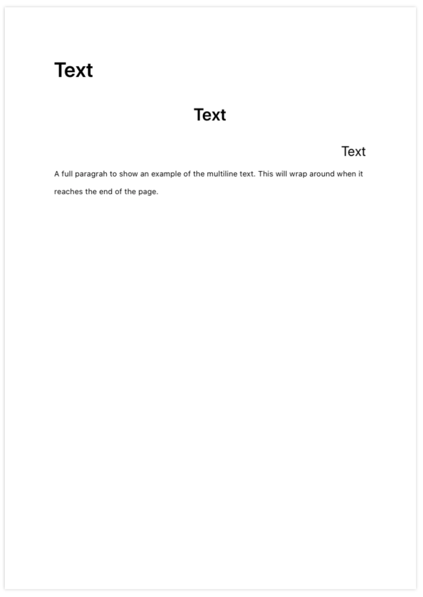
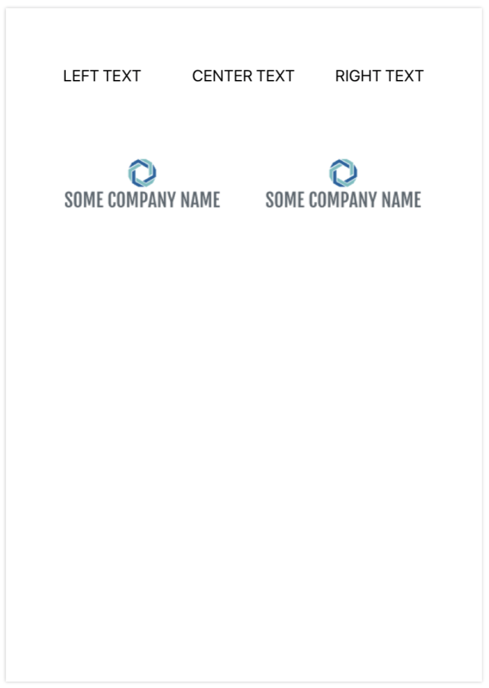

# SimplePDFBuilder
Simple tool to create complex PDF files easily.

## Introduction
`SimplePDFBuilder` is a library built on top of PDFKit and allows to easily create PDF files in your app. This is a customisable library allows to add text, images and other elements including complex tables, making creation of PDF very quick to develop and no need to draw everything from scratch.


## Table of Contents
- [How to use PDFBuilder](#PDF-Document-parameters)
    - [PDF Document parameters](#PDF-Document-parameters)
    - [Adding Text](#Adding-Text)
    - [Adding Images](#Adding-Images)
    - [Adding Footer](#Adding-Footer)
    - [Adding Tables](#Adding-Tables)
    - [Adding Spaces](#Adding-Spaces)
    - [Line holding](#Line-holding)
- [How to use built-in PDF Preview View Controller](#How-to-use-built-in-PDF-Preview-View-Controller)
- [License](#License)


## How to use PDFBuilder
In order to create simple PDF file with no content on it, you need to import SimplePDFBuilder where you want to use it: 

```swift
import SimplePDFBuilder
```

To build pdf data:
```swift
let pdf = PDFBuilder()
// adding elements such as text, etc.
let pdfData = pdf.build()

// OR

let pdfData = PDFBuilder()
            //.someChosenMethod
            //...
            .build()
```

## PDF Document parameters

In order to add metadata to your PDF File use the following:
```swift
let pdf = PDFBuilder()
pdf.metaAuthor = "Maks"
pdf.metaCreator = "Maks"
pdf.metaTitle = "My PDF"
```

There are a few additional **global** parameters that can be set:

```swift         
pdf.paperSize = .A4              // default
pdf.paperOrientation = .Portrait // default
pdf.textSpacing = 1.08           // default
pdf.paperMargins = .Normal       // default
```

- **_paperSize_**: can be from A1 to A7 size
- **_paperOrientation_**: can be .Portrait or .Album
- **_textSpacing_**: Spacing of the text in CGFloat
- **_paperMargins_**:
    - _.Normal_ - Inch (2.54cm) on each side
    - _.Narrow_ - Half inch (1.27cm) on each side
    - _.Moderate_ - Inch (2.54cm) for top and bottom and 0.75 inch (or 1.91 cm) for left and right
    - _.Wide_ - Inch (2.54cm) for top and bottom and 2 inches (5.08 cm) for left and right


## Adding Text
To add text _addText_ method is used:



```swift
pdf.addText(text: "BILL TO:", 
            alignment: .left,             // default value
            font: .boldArial(ofSize: 11), // default value
            colour: .black)               // default value
```
- **_alignment_** - Alignment of the text on the page
- **_font_** - Font of the text
- **_colour_** - Colour of the text


See example on the right:
```swift
pdf.addText(text: "Text", alignment: .left, font: .boldSystemFont(ofSize: 30))
pdf.addText(text: "Text", alignment: .centre, font: .boldSystemFont(ofSize: 25))
pdf.addText(text: "Text", alignment: .right, font: .systemFont(ofSize: 20))
```


## Adding Images
In order to add image to the PDF use:


```swift
pdf.addImage(image: UIImage(named:"Put Your Image Here"), 
             maxWidth: 150, 
             alignment: .right)
```
- **_image_** - UIImage that you want to present on the PDF
- **_maxWidth_** - Width of the image in points (72 points is 1 inch)
- **_alignment_** - Alignment of the text on the page

See example on the right:
```swift
pdf.addImage(image: #imageLiteral(resourceName: "ShowLogo"), maxWidth: 300, alignment: .left)
pdf.addSpace(inches: 1)
pdf.addImage(image: #imageLiteral(resourceName: "ShowLogo"), maxWidth: 200, alignment: .centre)
pdf.addSpace(inches: 1)
pdf.addImage(image: #imageLiteral(resourceName: "ShowLogo"), maxWidth: 150, alignment: .right)
```
To understand what _addSpace_ does refer to [Adding Spaces](#Adding-Spaces) section


## Adding Footer
To add footer to the PDF use:

```swift
pdf.addFooter(pagingEnabled: true,
              text: "© Company copyrights reserved example.",
              colour: UIColor.black.withAlphaComponent(0.5))
```
However, if footer is being added from the current PDF page, therefore, the footer will be drawn only from the second page (example):

```swift
pdf.newPage()  // start new PDF page
pdf.addFooter(pagingEnabled: true,
              text: "© Company copyrights reserved example.",
              colour: UIColor.black.withAlphaComponent(0.5))
```

## Adding Tables

To create tables you will first have to create headers and rows. If the rows will reach the bottom margin then the new PDF page will start

Create **headers** as follows:

```swift
let headers = [ PDFColumnHeader(name: "QTY",         alignment: .left,    weight: 1),
                PDFColumnHeader(name: "DESCRIPTION", alignment: .centre,  weight: 4),
                PDFColumnHeader(name: "PRICE",       alignment: .right,   weight: 2)]
```
- **_name_** - Text that will be shown in Table Column's header

- **_alignment_** - Alignment of the **whole** column

- **_weight_** - Weight of the column in comparison with others. In above example, it means that 2nd column will be 4 times wider than first column and twice wider than the 3rd


Create **table rows** as follows:
```swift
let tableRows = [ PDFTableRow(["1",  "description",  "10"]),
                  PDFTableRow(["2",  "description",  "15"]) ]
```

Draw **table** from headers and table rows:
```swift
do {
    try pdf.addTable(headers: headers, 
                     rows: tableRows, 
                     tableStyle: .Modern,            // Default value
                     font: .systemFont(ofSize: 11), // Default value
                     tableColour: .darkGray)        // Default value
} catch {
    print(error.localizedDescription)
}
```
- **_tableColour_** - Theme colour of the table

- **_font_** - Font of the text in the table

- **_tableStyle_** - Currently 2 types are supported:


#### PDF Table styles
| Modern | Strict |
| ---- | ---- |
|  |  |


## Adding Spaces
There are to ways of creating space: In inches and in centimeters

```swift
pdf.addSpace(inches: 1.25)
pdf.addSpace(centimeters: 3.4)

pdf.addSpace(inches: -0.5) //Note: it can be negative if needed
```

## Line holding



Line holding allows to draw multiple elements with the same top offset in the page.

```swift
pdf.holdLine()
pdf.addText(text: "LEFT TEXT", font: .systemFont(ofSize: 20))
pdf.addText(text: "CENTER TEXT", alignment: .centre, font: .systemFont(ofSize: 20))
pdf.addText(text: "RIGHT TEXT", alignment: .right, font: .systemFont(ofSize: 20))
pdf.releaseLine()

pdf.addSpace(inches: 1)

pdf.holdLine()
pdf.addImage(image: #imageLiteral(resourceName: "ShowLogo"), maxWidth: 200,alignment: .left)
pdf.addImage(image: #imageLiteral(resourceName: "ShowLogo"), maxWidth: 200,alignment: .right)
pdf.releaseLine()
```


## How to use built-in PDF Preview View Controller
The library comes with the built-in controller called `PDFPreviewVC`. It is shown at the very top (first image) of the readme. If you want to use it, here is the code. Make sure your app uses **NavigationController**:

```swift
let pdf = PDFBuilder()

pdf.metaAuthor = "Maks"
pdf.metaCreator = "Maks"
pdf.metaTitle = "My PDF"

pdf.addFooter(pagingEnabled: true,
              text: "© Company copyrights reserved footer.",
              colour: UIColor.black.withAlphaComponent(0.5))

pdf.addText(text: "Sample text")

let headers = [ PDFColumnHeader(name: "QTY",         alignment: .left,    weight: 1),
                PDFColumnHeader(name: "DESCRIPTION", alignment: .centre,  weight: 4),
                PDFColumnHeader(name: "PRICE",       alignment: .right,   weight: 2)]


var tableRows = [PDFTableRow]()
for _ in 0..<30 {
    tableRows.append( PDFTableRow(["1",  "description", "10"]) )
}

// Build PDF Data
let data = pdf.build()

let pdfController = PDFPreviewVC(pdfData: data)
navigationController?.pushViewController(pdfController, animated: true)
```


PDFPreviewVC View Controller has a few paramters that can be passed:

```swift
let pdfController = PDFPreviewVC(pdfData: data,
                                 pdfFileName: "Testname",
                                 removeFileOnClose: true)  // Default value
```
- **_pdfData_** - PDF Data that was generate by `PDFBuilder` using _.build()_

- **_pdfFileName_** - If the user will decide to share the file, that will be a name of it.

- **_removeFileOnClose_** - In order to rename and share the file, the app saves it to temprorary directory of the app and then shares it. If you don't want to keep the files set it to true and it will be removed on ViewController's dismissal.


## License

[](http://badges.mit-license.org)

- **[MIT license](http://opensource.org/licenses/mit-license.php)**
- Copyright 2020 © <a href="https://github.com/MaksBelenko" target="_blank">MaksBelenko</a>.

